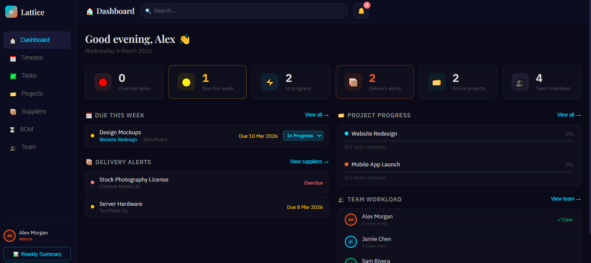
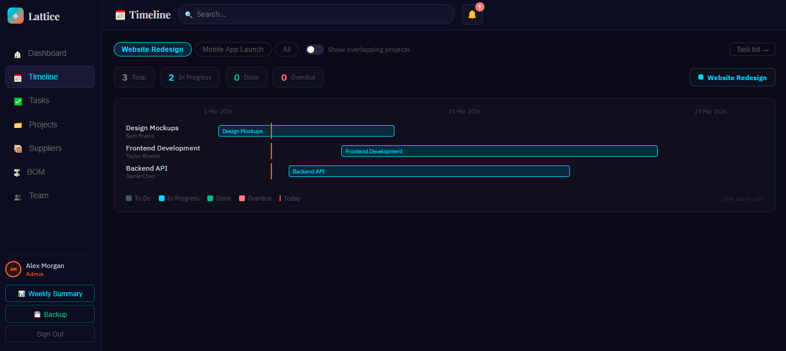
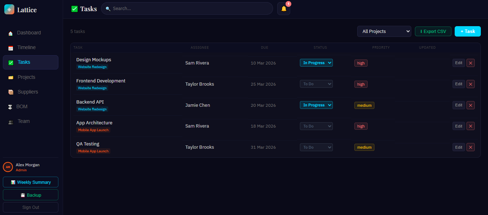
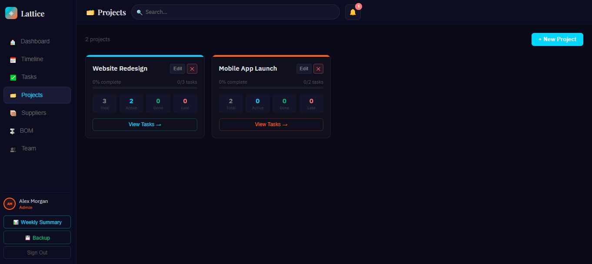
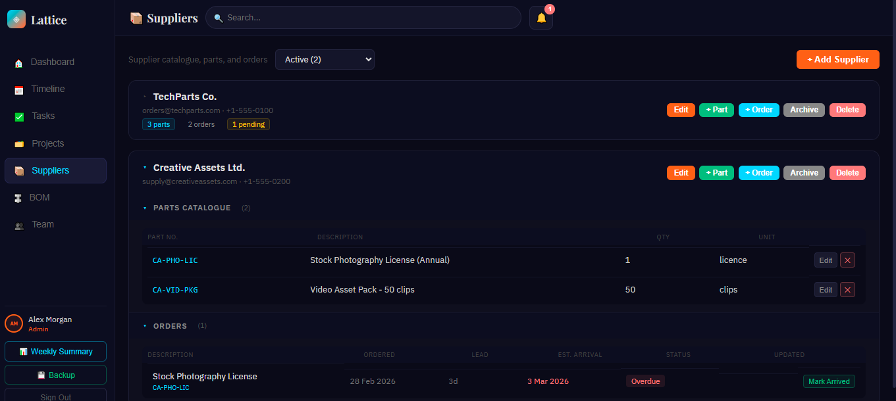
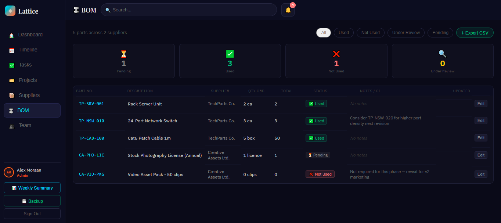
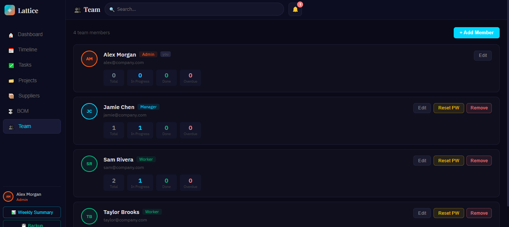

# ◈ Lattice PM

A self-hosted, browser-based project management tool built for small engineering and operations teams. Written in TypeScript and React, it runs as a web app and connects to a PocketBase backend — no cloud subscription required.

Teams using Lattice can track tasks, manage suppliers and bill of materials, monitor delivery schedules, and get a daily project briefing — all in one place. It is designed around the reality that engineering work involves procurement, dependencies, and people with different levels of system access, not just a to-do list.

**The problem it solves:** most project management tools are either too generic (no BOM, no supplier tracking) or too expensive and complex for a small team. Lattice is purpose-built for environments where tasks, parts, and delivery dates are all interconnected.

---

## Features

- **🏠 Dashboard** — Daily briefing: overdue tasks, delivery alerts, project progress and team workload. Clickable stat cards navigate to the relevant section.
- **📅 Timeline (Gantt)** — Project-focused Gantt. Select any project to focus, toggle "show overlapping projects" to see other timelines dimmed behind it. Date axis auto-scales, click any bar to edit the task. SVG dependency arrows between linked tasks.
- **✅ Tasks** — Create, assign and track tasks with status, priority, dates, project tagging and dependency linking. Blocked indicators when prerequisites are incomplete. CSV export respects the active filter.
- **🗂️ Projects** — Colour-coded projects with progress bars and per-project stats.
- **📦 Suppliers & Orders** — Collapsible supplier cards with parts catalogue and order tracking. Archive/delete suppliers. Filter by Active / Archived / Overdue.
- **🔩 BOM** — Bill of Materials linked to tasks and projects. Usage status, quantities and engineering notes. Alert indicators for delayed parts and overdue linked tasks. Filter by status or task/project.
- **👥 Team** — Role-based access. Add, edit and remove members. Password show/hide, strength meter, auto-generate and force-reset.
- **🔔 Notifications** — In-app alerts for overdue tasks, upcoming deadlines and tasks blocked by overdue dependencies.
- **💾 Backup & Restore** — Full JSON export/import with drag-and-drop restore.
- **🔍 Global Search** — Search across tasks, projects, suppliers, parts, orders, BOM notes and team members.
- **📊 Weekly Summary** — Role-filtered report. Copy as plain text or export as a standalone HTML file.
- **📱 PWA** — Installable on mobile and desktop, offline-capable, with a "new version available" update banner.
- **❓ Onboarding Guide** — Slide-in guide covering all features in dependency order, with a quick-reference mode.

---

## Roles

| Role | Access |
|------|--------|
| **Admin** | Full access — manage users, projects, tasks, suppliers, BOM |
| **Manager** | Manage tasks, suppliers, parts, orders and BOM — cannot manage users |
| **Office** | Manage tasks and view all data — no supplier or BOM editing |
| **Shopfloor** | View and update own assigned tasks only |

---

## Seeded Admin Account

_Create your first admin account manually via the PocketBase admin UI — see [POCKETBASE_SETUP.md](POCKETBASE_SETUP.md)._

---

## Getting Started

```bash
git clone https://github.com/Azzbo77/lattice-pm.git
cd lattice-pm
npm install
```

Create `.env.development` in the project root:

```
REACT_APP_PB_URL=http://127.0.0.1:8090
```

Run PocketBase locally, create the collections (see [DEPLOYMENT.md](DEPLOYMENT.md)), then seed the initial admin account:

```bash
npx ts-node --project scripts/tsconfig.json scripts/seed.ts \
  --url http://127.0.0.1:8090 \
  --email your@pocketbase-admin.email \
  --password yourPBadminpassword
```

**Or with Docker (recommended):**

```bash
docker compose up --build
```

App runs at http://localhost:3000, PocketBase admin at http://localhost:8090/_/.

**Or without Docker:**

```bash
npm start        # Development — http://localhost:3000
npm run build    # Production build → /build
```

Log in with `admin@lattice.dev` / `changeme123` and add your real account from the Team tab.

For detailed setup guides see:
- [POCKETBASE_SETUP.md](POCKETBASE_SETUP.md) — step-by-step collection and user setup
- [CLOUDFLARE_TUNNEL.md](CLOUDFLARE_TUNNEL.md) — expose Lattice via your domain using Cloudflare Tunnel
- [DEPLOYMENT.md](DEPLOYMENT.md) — Docker, nginx and Pi deployment reference

---

## Project Structure

```
├── pb_migrations/
│   └── 1_initial_schema.json  # PocketBase collection schemas + access rules
│
├── scripts/
│   ├── seed.ts                # Creates initial admin account
│   └── tsconfig.json          # ts-node config for scripts
│
├── public/
│   ├── sw.js                  # Service worker — caching strategies
│   ├── manifest.json          # PWA manifest
│   └── index.html
│
└── src/
    ├── App.tsx                # Layout, tab routing, modal rendering
    ├── index.tsx
    ├── types.ts               # All domain interfaces and types
    │
    ├── lib/
    │   ├── pb.ts              # PocketBase client singleton
    │   └── db.ts              # Typed data layer — all CRUD + realtime subscriptions
    │
    ├── context/
    │   └── AppContext.tsx     # Single source of truth — async state + handlers
    │
    ├── hooks/
    │   ├── useSearch.ts       # Global search engine
    │   └── useBreakpoint.ts   # Responsive breakpoint detection
    │
    ├── utils/
    │   ├── csvExport.ts
    │   └── dateHelpers.ts
    │
    ├── constants/
    │   ├── theme.ts           # Design tokens — colours, spacing, typography, radii
    │   └── seeds.ts           # ROLES, colour maps, BOM status meta
    │
    ├── components/
    │   ├── ui/index.tsx       # Shared primitives — Btn, TH, TD, Overlay, Avatar, etc.
    │   ├── Sidebar.tsx
    │   ├── SearchBar.tsx
    │   └── NotificationBell.tsx
    │
    ├── modals/
    │   ├── TaskModal.tsx
    │   ├── ProjectModal.tsx
    │   ├── SupplierModals.tsx
    │   ├── BomModal.tsx
    │   ├── MemberModal.tsx
    │   ├── BackupModal.tsx
    │   ├── WeeklySummaryModal.tsx
    │   └── GuidePanel.tsx     # Onboarding guide + APP_VERSION constant
    │
    └── pages/
        ├── AuthScreens.tsx
        ├── DashboardPage.tsx
        ├── GanttPage.tsx
        ├── TasksPage.tsx
        ├── ProjectsPage.tsx
        ├── SuppliersPage.tsx
        ├── BomPage.tsx
        └── TeamPage.tsx
```

---

## Changelog

### v4.2 — Backend & Access Control
- Role system updated: `admin`, `manager`, `office`, `shopfloor` (replaces `worker`)
- PocketBase migration rules aligned to new roles — explicit allow-lists per collection
- `canSuppliers` permission: admin and manager only (Office removed from supplier/BOM editing)
- Demo account quick-fill removed from login screen; seed script now creates a single bootstrap admin account
- `useStorage`, `useSession` and `password.ts` removed from active use (PocketBase handles auth)
- Seed script and docs cleaned of personal identifiers and stale role references

### v4.1 — PocketBase Integration
- `src/lib/pb.ts` — PocketBase client singleton; reads `REACT_APP_PB_URL`
- `src/lib/db.ts` — typed data layer: mapper functions for all 6 collections, CRUD for every entity, `subscribeToCollection` wrapper
- `AppContext.tsx` — fully rewritten: async handlers, localStorage removed, `Promise.all` initial load, 7 realtime subscriptions, `loading` state, session via `pb.authStore`
- All modal/page call sites updated to `async/await`
- Loading spinner shown while initial data fetch completes

### v4.0 — PocketBase Schema & Deployment Docs
- `pb_migrations/1_initial_schema.json` — schema for all 6 collections with field types, relation constraints and row-level security rules
- `DEPLOYMENT.md` — full setup guide for Windows dev and Pi production: PocketBase, nginx with SSE support, deploy workflow, troubleshooting
- Self-referencing `tasks.dependsOn` relation; cascade deletes from suppliers to parts/orders/bom

### v3.x — Polish & PWA
| Version | What changed |
|---------|-------------|
| 3.7 | PWA: service worker with three caching strategies, installable icons, update banner, `serviceWorkerRegistration.ts` |
| 3.6 | Onboarding guide panel (9-step workflow + quick-reference mode), `APP_VERSION` badge |
| 3.5 | Session persistence — 8-hour TTL, `sessionReady` flag prevents login flash, auto-logout on expiry |
| 3.4 | bcryptjs password hashing, CRACO Webpack 5 config, startup migration for legacy plain-text passwords |
| 3.3 | WCAG AA accessibility — ARIA labels/roles/states, keyboard navigation, focus management, reduced motion |
| 3.2 | React.memo on all heavy list components, `useMemo` audit across all pages |
| 3.1 | Table column alignment audit — text left, data/badges/actions centred, applied consistently |
| 3.0 | Theme centralisation — `theme.ts` design tokens, 960+ magic values replaced across 19 files |

### v2.x — Core Workflow
| Version | What changed |
|---------|-------------|
| 2.9 | BOM ↔ Task bridging — `projectId`/`taskId` links, alert indicators, task/project filter |
| 2.8 | Task dependencies — `dependsOn` multi-select, Gantt SVG arrows, blocked indicators |
| 2.7 | Suppliers mini-epic — collapsible cards, archive/delete, page-level filters |
| 2.6 | Full TypeScript migration — `types.ts`, all 29 files, strict mode |
| 2.5 | Dashboard UI polish — dropdown contrast, colour-coded selects |
| 2.4 | Mobile/responsive — bottom tab bar, sheet modals, horizontal-scroll tables |
| 2.3 | Last-updated timestamps — `updatedAt`/`updatedBy`, UpdatedBadge, Recent Activity feed |
| 2.2 | Weekly Summary generator — role-filtered, copy text + HTML export |
| 2.1 | Project-focused Gantt — pill selector, show-all overlay, date axis, click-to-edit |
| 2.0 | Full modular refactor — context, hooks, utils, pages, modals (26 files) |

### v1.x — Foundation
| Version | What changed |
|---------|-------------|
| 1.5 | Backup/restore with storage meter and drag-and-drop import |
| 1.4 | Global search across all entities |
| 1.3 | CSV export for BOM and Tasks |
| 1.2 | Dashboard home screen |
| 1.1 | Project management, password UX improvements |
| 1.0 | Initial release |

---

## Roadmap

### Phases 1–4 *(complete)*
Timestamps, Weekly Summary, mobile layout, TypeScript, theme centralisation, performance, accessibility, password hashing, session management, PWA, onboarding guide, PocketBase backend, role system.

### Phase 5 — Production Polish *(future)*
- Reporting — exportable PDF/Excel reports, project burn-down charts, supplier performance dashboard
- Security audit — input sanitisation, role enforcement review, session expiry
- Dependency & Gantt enhancements — critical path highlighting, milestone markers, drag-to-reschedule bars

---

## Screenshots

### Dashboard
Daily briefing with stat cards, due-this-week tasks, delivery alerts, project progress and team workload at a glance.



### Timeline
Project-focused Gantt with pill selector, status breakdown, dependency arrows and click-to-edit task bars.



### Tasks
Create, assign and track tasks with status, priority, dates, project tagging, dependency linking and CSV export.



### Projects
Colour-coded project cards with progress bars and per-project task breakdown.



### Suppliers
Collapsible supplier cards with parts catalogue and order tracking.



### BOM
Bill of Materials linked to tasks and projects, with usage status, alert indicators and CSV export.



### Team
Role-based access control. Add, edit or remove team members with password reset options.



---

## Built With

- [React 18](https://react.dev/) + Create React App
- [PocketBase](https://pocketbase.io/) — self-hosted backend, auth and realtime
- TypeScript 4.9.5
- Google Fonts — Playfair Display + IBM Plex Sans
- [Docker](https://www.docker.com/) + nginx — containerised deployment

---

## Licence

[MIT](https://opensource.org/licenses/MIT)
