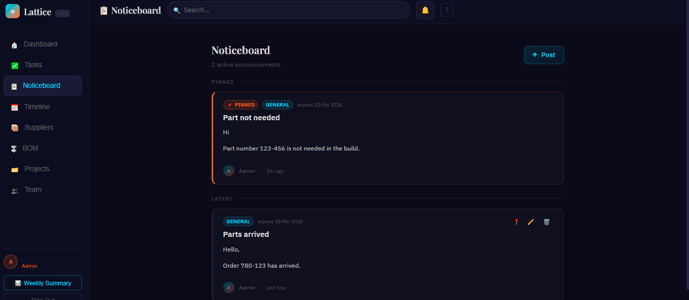

# ◈ Lattice PM

A self-hosted, browser-based project management tool built for small engineering and operations teams. Written in TypeScript and React, it runs as a Docker container and connects to a PocketBase backend — no cloud subscription, no per-seat fees.

Teams using Lattice can track tasks, manage suppliers and bill of materials, monitor delivery schedules, post team announcements, and get a daily project briefing — all in one place. It is designed around the reality that engineering work involves procurement, dependencies, and people with different levels of system access, not just a to-do list.

**The problem it solves:** most project management tools are either too generic (no BOM, no supplier tracking) or too expensive and complex for a small team. Lattice is purpose-built for environments where tasks, parts, and delivery dates are all interconnected.

---

## Features

- **🏠 Dashboard** — Daily briefing: overdue tasks, delivery alerts, project progress and team workload. Clickable stat cards navigate to the relevant section.
- **📅 Timeline (Gantt)** — Project-focused Gantt. Select any project to focus, toggle "show overlapping projects" to see other timelines dimmed behind it. Date axis auto-scales, click any bar to edit the task. SVG dependency arrows between linked tasks.
- **✅ Tasks** — Create, assign and track tasks with status, priority, dates, project tagging and dependency linking. Blocked indicators when prerequisites are incomplete. CSV export respects the active filter.
- **🗂️ Projects** — Colour-coded projects with progress bars and per-project stats.
- **📦 Suppliers & Orders** — Collapsible supplier cards with parts catalogue and order tracking. Archive/delete suppliers. Filter by Active / Archived / Overdue.
- **🔩 BOM** — Bill of Materials linked to tasks and projects. Add entries from the BOM tab, selecting supplier and part then linking to any project or task. Usage status, quantities and engineering notes. Alert indicators for delayed parts and overdue linked tasks. Filter by status or task/project.
- **👥 Team** — Role-based access. Add, edit and remove members. Password show/hide, strength meter, auto-generate and force-reset.
- **📋 Noticeboard** — Team announcements with basic markdown (bold, italic, links, lists). Pin important posts to the top, set optional expiry dates, and tag teammates with `@Name` — tagged users are notified in the bell.
- **🔔 Notifications** — In-app alerts for overdue tasks, upcoming deadlines, tasks blocked by overdue dependencies, and `@mention` notifications from the Noticeboard.
- **🔍 Global Search** — Search across tasks, projects, suppliers, parts, orders, BOM notes and team members.
- **📊 Weekly Summary** — Role-filtered report. Copy as plain text or export as a standalone HTML file.
- **📱 PWA** — Installable on mobile and desktop, offline-capable, with a "new version available" update banner.
- **❓ Onboarding Guide** — Slide-in guide covering all features in dependency order, with a quick-reference mode.

---

## Roles

| Role | Access |
|------|--------|
| **Admin** | Full access — manage users, projects, tasks, suppliers, BOM, announcements |
| **Manager** | Manage tasks, suppliers, parts, orders and BOM — cannot manage users |
| **Office** | Manage tasks and view all data — no supplier or BOM editing |
| **Shopfloor** | View and update own assigned tasks only |

All roles can read and post announcements on the Noticeboard.

---

## Getting Started

### With Docker (recommended)

```bash
git clone https://github.com/Azzbo77/lattice-pm.git
cd lattice-pm

# Development
docker compose up --build

# Production (Pi or server)
docker compose -f docker-compose.yml -f docker-compose.prod.yml up -d --build
```

App runs at `http://localhost:8080`, PocketBase admin at `http://localhost:8090/_/`.

Follow **[POCKETBASE_SETUP.md](POCKETBASE_SETUP.md)** to create your superuser, import the bundled schema (`pb_migrations/1_initial_schema.json`), and create your first Lattice user.

### Without Docker

```bash
git clone https://github.com/Azzbo77/lattice-pm.git
cd lattice-pm
npm install
```

Copy `.env.local.example` to `.env.local`:

```bash
cp .env.local.example .env.local
```

Download and run PocketBase separately (see [POCKETBASE_SETUP.md](POCKETBASE_SETUP.md)), then:

```bash
npm start        # Development — http://localhost:3000
npm run build    # Production build → /dist
```

### Further reading

- [POCKETBASE_SETUP.md](POCKETBASE_SETUP.md) — step-by-step collection, rules and first-user setup
- [DEPLOYMENT.md](DEPLOYMENT.md) — Docker, nginx and Pi deployment reference
- [CLOUDFLARE_TUNNEL.md](CLOUDFLARE_TUNNEL.md) — expose Lattice via your domain using Cloudflare Tunnel

---

## Project Structure

```
├── pb_migrations/
│   └── 1_initial_schema.json  # All 8 collections, fields and API rules —
│                              #   import via Settings → Import collections
│
├── public/
│   ├── sw.js                  # Service worker — caching strategies
│   ├── manifest.json          # PWA manifest
│   ├── apple-touch-icon.png   # PWA icons
│   ├── icon-192.png
│   ├── icon-512.png
│   └── screenshots/           # PWA store screenshots
│
├── index.html                 # App entry point (Vite — lives at project root)
│
└── src/
    ├── App.tsx                # Layout, tab routing, modal rendering
    ├── index.tsx              # App entry point + crypto.randomUUID polyfill
    ├── types.ts               # All domain interfaces and types
    │
    ├── lib/
    │   ├── pb.ts              # PocketBase client singleton
    │   └── db.ts              # Typed data layer — all CRUD + realtime subscriptions
    │
    ├── context/
    │   ├── AppContext.tsx          # Thin composition layer — merges all sub-contexts,
    │   │                          #   exposes single useApp() hook (no logic lives here)
    │   ├── AuthContext.tsx         # Session state, login/logout, password reset, role flags
    │   ├── DataContext.tsx         # All data state, CRUD handlers, realtime subscriptions,
    │   │                          #   derived bomRows/filteredBom
    │   ├── UIContext.tsx           # Tab, filters, all modal state, all confirm dialogs
    │   └── NotificationsContext.tsx# Task overdue/due-soon + @mention notifications
    │
    ├── hooks/
    │   ├── useBreakpoint.ts   # Responsive breakpoint detection
    │   ├── usePagination.ts   # Generic pagination — page/totalPages/pageItems, resets on filter change
    │   ├── useSearch.ts       # Global search engine (tasks, projects, suppliers, parts, BOM, team)
    │   ├── useSession.ts      # Session persistence helpers
    │   └── useStorage.ts      # Local storage abstraction
    │
    ├── utils/
    │   ├── csvExport.ts
    │   ├── dateHelpers.ts
    │   └── password.ts        # Password strength + bcrypt helpers
    │
    ├── constants/
    │   ├── theme.ts           # Design tokens — colours, spacing, typography, radii
    │   └── seeds.ts           # ROLES, colour maps, BOM status meta
    │
    ├── components/
    │   ├── ui/index.tsx       # Shared primitives — Btn, TH, TD, Overlay, ConfirmModal, Pager, etc.
    │   ├── Sidebar.tsx        # Desktop nav + mobile bottom tab bar (primary 5 + More sheet)
    │   ├── SearchBar.tsx
    │   └── NotificationBell.tsx # Task alerts + @mention notifications, grouped by type
    │
    ├── modals/
    │   ├── TaskModal.tsx
    │   ├── ProjectModal.tsx
    │   ├── SupplierModals.tsx
    │   ├── BomModal.tsx       # Add + edit BOM entries; supplier/part selectors for new entries
    │   ├── MemberModal.tsx
    │   ├── WeeklySummaryModal.tsx
    │   └── GuidePanel.tsx     # Onboarding guide + APP_VERSION constant
    │
    └── pages/
        ├── AuthScreens.tsx
        ├── DashboardPage.tsx
        ├── GanttPage.tsx
        ├── TasksPage.tsx      # Mobile card layout + desktop table; paginated (25/page)
        ├── ProjectsPage.tsx
        ├── SuppliersPage.tsx  # Mobile-aware sub-tables; paginated (10/page); supplier email field
        ├── BomPage.tsx        # Mobile card layout + desktop table; paginated (20/page)
        ├── TeamPage.tsx
        └── Noticeboard.tsx    # Announcements feed with markdown, pins, expiry, @mentions
```

---

## Changelog

### v4.8 — Mobile Polish
- `TasksPage` — full mobile card layout added alongside desktop table; cards show title, project badge, priority, blocked/deps indicators, assignee, due date, status select, and edit/delete actions; no horizontal scroll on mobile
- `DashboardPage` — task rows in Overdue, Due This Week and In Progress sections now wrap correctly on narrow screens instead of overflowing
- `ProjectsPage` and `GanttPage` — already mobile-aware, no changes needed
- `useSearch` — supplier search now matches on `email` field; result subtitle shows email if present
- `APP_VERSION` bumped to `v4.8` in UI

### v4.7 — Pagination
- `usePagination` hook added — generic, resets to page 1 whenever the source list changes (filter/search applied)
- `Pager` component added to shared UI — renders nothing when only one page; shows record range, prev/next, numbered page buttons with ellipsis; styled to match dark theme
- `TasksPage` paginated — 25 per page, desktop and mobile layouts both paginated
- `BomPage` paginated — 20 per page, desktop table and mobile cards both paginated
- `SuppliersPage` paginated — 10 per page (supplier cards expand with parts/orders so fewer per page)
- `seeds.ts` — `email: ""` added to sample supplier objects to match updated `Supplier` type

### v4.6 — AppContext Refactor & Logout Fix
- `AppContext.tsx` split into four focused contexts: `AuthContext` (session/login), `DataContext` (all CRUD + realtime), `UIContext` (tab/filter/modal state), `NotificationsContext` (task + mention alerts) — `AppContext` is now a thin composition layer; all existing `useApp()` calls unchanged
- Fixed logout bug: switching users on the same session no longer briefly shows the previous user's data — all data state is explicitly cleared and `loading` reset to `true` on logout
- `APP_VERSION` bumped to `v4.6` in UI

### v4.5 — Mobile Polish & Onboarding
- Mobile tab bar reordered — Noticeboard promoted to primary 5 tabs (Dashboard, Tasks, Noticeboard, Timeline, Suppliers); BOM, Projects and Team moved to "More" sheet so shopfloor users on phones see the most relevant tabs immediately
- BOM page: full card layout on mobile replacing the wide horizontal-scroll table — shows part number, description, supplier, qty, status, linked task/project, notes and alert indicators in a readable stacked format
- Suppliers page: sub-table min-widths reduced on mobile so parts and orders tables require less horizontal scrolling
- Onboarding Guide updated to v4.5 — Noticeboard step added (step 7 of 10) covering posting, markdown, pinning, expiry and @mentions; backup step rewritten to describe PocketBase Settings → Backups instead of the removed localStorage backup; "Worker" renamed to "Shopfloor" throughout to match actual role names
- `APP_VERSION` bumped to `v4.5` in UI

### v4.4 — Noticeboard & @Mentions
- New **Noticeboard** page — pinned announcements section + chronological feed
- Markdown support in post body: `**bold**`, `*italic*`, `[links](url)`, `- bullet lists`, with live preview toggle
- Pin posts to top with orange visual treatment; set optional expiry date (expired posts auto-hide)
- `@mention` autocomplete — type `@` in the post body to get a dropdown of team members; selected names inserted inline
- `@Name` renders highlighted in cyan in posted announcements
- Tagged users receive a `📣 Mentions` notification in the bell, separate from task alerts; clicking navigates to the Noticeboard
- All roles can read and post; edit/pin/delete controls visible on hover
- Realtime subscription — new posts appear instantly across all open sessions
- `announcements` collection added to PocketBase schema

### v4.3 — Vite Migration
- Migrated from Create React App + CRACO to **Vite 5**
- Build output moved from `/build` to `/dist`
- `index.html` moved to project root (Vite convention)
- `REACT_APP_*` env vars renamed to `VITE_*`; `process.env` replaced with `import.meta.env`
- `src/react-app-env.d.ts` replaced with `src/vite-env.d.ts`
- `vite.config.ts` added; `craco.config.js` removed
- Dockerfile and docker-compose files updated for new build output path and env var names
- Significantly faster dev builds and HMR

### v4.2 — Backend, Access Control & Bug Fixes
- PocketBase integration complete — all CRUD operations, realtime subscriptions, session via `pb.authStore`
- Backup/restore removed — PocketBase handles backups natively via Settings → Backups
- All collection names corrected to `_pb_users_auth_` throughout `db.ts`
- Fake client-side IDs replaced with empty string — PocketBase now generates real IDs on create
- `assigneeId` sends `null` instead of `""` so PocketBase relation fields accept it correctly
- Cascade deletes: removing a project first deletes its tasks; removing a supplier first deletes its BOM entries, orders and parts
- BOM tab: Add Entry button added; BomModal rewritten to handle both new and edit flows
- BOM rows: Delete button added with consistent ConfirmModal
- `crypto.randomUUID` polyfilled in `index.tsx` for environments that don't support it natively
- SVG Gantt dependency arrows fixed — `viewBox` added so coordinates render correctly
- Docker: volume mount corrected to `/pb_data`; PocketBase upgraded to `0.23.4`
- POCKETBASE_SETUP.md rewritten to reflect actual working setup process

### v4.1 — PocketBase Integration
- `src/lib/pb.ts` — PocketBase client singleton; reads `VITE_PB_URL`
- `src/lib/db.ts` — typed data layer: mapper functions for all collections, CRUD for every entity, `subscribeToCollection` wrapper
- `AppContext.tsx` — fully rewritten: async handlers, localStorage removed, `Promise.all` initial load, realtime subscriptions, `loading` state, session via `pb.authStore`
- All modal/page call sites updated to `async/await`

### v4.0 — PocketBase Schema & Deployment Docs
- `pb_migrations/1_initial_schema.json` — schema for all collections with field types, relation constraints and API rules
- `DEPLOYMENT.md` — full setup guide: PocketBase, nginx with SSE support, Docker Compose, Pi deployment
- Self-referencing `tasks.dependsOn` relation; cascade deletes from suppliers to parts/orders/bom

### v3.x — Polish & PWA
| Version | What changed |
|---------|-------------|
| 3.7 | PWA: service worker, installable icons, update banner |
| 3.6 | Onboarding guide panel (9-step workflow + quick-reference mode) |
| 3.5 | Session persistence — 8-hour TTL, `sessionReady` flag, auto-logout |
| 3.4 | bcryptjs password hashing, CRACO Webpack 5 config |
| 3.3 | WCAG AA accessibility — ARIA, keyboard navigation, focus management |
| 3.2 | React.memo + `useMemo` performance pass |
| 3.1 | Table column alignment audit |
| 3.0 | Theme centralisation — `theme.ts` design tokens |

### v2.x — Core Workflow
| Version | What changed |
|---------|-------------|
| 2.9 | BOM ↔ Task bridging — `projectId`/`taskId` links, alert indicators |
| 2.8 | Task dependencies — `dependsOn` multi-select, Gantt SVG arrows, blocked indicators |
| 2.7 | Suppliers — collapsible cards, archive/delete, page-level filters |
| 2.6 | Full TypeScript migration — strict mode across all files |
| 2.5 | Dashboard UI polish |
| 2.4 | Mobile/responsive — bottom tab bar, sheet modals |
| 2.3 | Timestamps — `updatedAt`/`updatedBy`, Recent Activity feed |
| 2.2 | Weekly Summary — role-filtered, copy text + HTML export |
| 2.1 | Project-focused Gantt — pill selector, date axis, click-to-edit |
| 2.0 | Full modular refactor — context, hooks, utils, pages, modals |

### v1.x — Foundation
| Version | What changed |
|---------|-------------|
| 1.4 | Global search |
| 1.3 | CSV export for BOM and Tasks |
| 1.2 | Dashboard |
| 1.1 | Projects, password UX |
| 1.0 | Initial release |

---

## Roadmap

### Phases 1–4 *(complete)*
Timestamps, Weekly Summary, mobile layout, TypeScript strict mode, theme centralisation, performance, accessibility, PWA, onboarding guide, PocketBase backend, role system, Docker deployment, realtime subscriptions, BOM entry creation, cascade deletes, bug fixes, Vite migration, Noticeboard with @mentions.

### Quick Wins *(low effort, high value)*
- ✅ ~~**Pagination / infinite scroll**~~ — Tasks, BOM and Suppliers paginated (25/20/10 per page); `usePagination` hook + `Pager` component
- ✅ ~~**Split AppContext**~~ — split into `AuthContext`, `DataContext`, `UIContext`, `NotificationsContext`; `AppContext` is now a thin composition layer
- **Vitest + React Testing Library** — add tests for `db.ts` CRUD functions and at least one page component
- **PocketBase API docs** — PocketBase auto-generates OpenAPI docs; add usage examples to DEPLOYMENT.md so others can build integrations
- **Demo video** — a short Loom walkthrough pinned to the README would help adoption significantly

### Phase 5 — Production Hardening
1. **Reporting & exports** — PDF/HTML dashboards, burn-down charts, supplier performance metrics
2. ✅ ~~**Mobile polish**~~ — card layouts on Tasks and BOM, responsive Dashboard, Suppliers sub-table scaling
3. **Dependency auto-scheduling** — critical-path calculation with basic scheduling hints on the Gantt
4. **Inventory lite** — stock levels, minimum reorder quantity alerts
5. **Calendar & digest** — iCal export and email digests via PocketBase hooks or a simple cron job
6. **CSV/Trello/Jira import** — significant adoption driver; import existing projects without manual re-entry
7. **Security hardening** — CSP headers via nginx, proper security header audit, optional 2FA via PocketBase extensions
8. **Multi-project portfolio view** — cross-project Gantt and resource view
9. **PocketBase exit ramp** — document migration path if the project outgrows PocketBase limits

---

## Screenshots

### Dashboard


### Timeline


### Tasks


### Projects


### Suppliers


### BOM


### Team


### Noticeboard


---

## Built With

- [React 18](https://react.dev/) + [Vite 5](https://vitejs.dev/)
- [PocketBase 0.23](https://pocketbase.io/) — self-hosted backend, auth and realtime
- TypeScript 4.9.5
- Google Fonts — Playfair Display + IBM Plex Sans
- [Docker](https://www.docker.com/) + nginx — containerised deployment

---

## Licence

[MIT](https://opensource.org/licenses/MIT)
